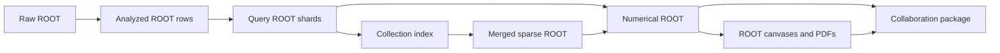

# Heavy-flavour balancing in PYTHIA 8

This repository measures heavy-flavour correlations and balancing yields in pp events from complete PYTHIA tune configurations. It compares MONASH, JUNCTIONS and CLOSEPACKING at a collision energy of 13.6 TeV.

The sample selects hard charm and beauty production. It is a generator-level, heavy-flavour-biased sample. It is not a minimum-bias sample or a detector-level prediction. Reported uncertainties describe finite Monte Carlo statistics only. The calculation does not evaluate systematic uncertainty, agreement with data or the effect of one isolated tune parameter.

## Repository contents

The repository contains generation, analysis, ROOT query, statistical reduction, plotting and package verification code. It also contains configuration, the accepted source inventory and small synthetic ROOT fixtures. The [result package](data/results/manifest.json) includes numerical ROOT, canvases, 41 PDFs, tables and covariance records. Download the complete merged ROOT files from the [data access guide](data/README.md#download-merged-root). Bulk raw, analyzed and query support files remain in external storage.

The source inventory records 3,000 accepted files and 300 million successful events. Each tune contributes 100 million events in ten original source blocks. The [data inventory](data/README.md) binds the distributed results and external inputs to checksums. The [sample accounting guide](docs/science.md#sample-accounting) explains the 127 discarded job attempts.

## Use the results

Open the [multiplicity distribution](data/results/figures/multiplicity.composite.pdf) or the other [figure PDFs](data/results/figures). The [data guide](data/README.md) explains how to verify the package, change its presentation and download merged THnSparse files. These operations do not require event generation or merging.

## Start locally

Use a Git checkout with Python 3.9 or later and a C++17 compiler. ROOT stages require ROOT with PyROOT. Event generation requires PYTHIA 8.317. The prepared HTCondor route has stricter [runtime requirements](docs/installation.md#runtime-contract).

Run these commands from the repository root:

```sh
./hadronization --help
./hadronization doctor
python3 pipeline/generate/study_contract.py check
./hadronization generate
./hadronization clean --dry-run
```

`doctor` reports the resolved environment. It does not prove that ROOT or PYTHIA can execute every stage. The default `generate` command inventories the campaign and does not submit jobs. The default `clean` command only lists removable files.

Follow [installation](docs/installation.md) to configure dependencies and run the development suite. A downloaded source archive lacks the Git identity required by provenance checks. Use a Git clone for execution.

## Data flow



Query files retain exact support rows and block-resolved THnSparse histograms. The physical merge stores sparse objects by tune and original block. Reduction still reads support rows from the query shards. Keep those shards with the merged collection.

The native estimator computes pooled results and delete-one-source-block jackknife covariance. `numerics.root` stores values, uncertainties, covariance factors, statuses and provenance. The renderer reads these numerical results without recomputing observables.

## Main choices

- The default charm-meson trigger is D0, PDG 421. D+, PDG 411, is an explicit alternative.

- Inclusive pair observables have no fixed final-hadron pT floor or event-wise pT ordering.

- Optional rectangular minima require `trigger_min >= associate_min`. Both particle cuts include their endpoints.

- Charged-light activity counts final charged particles without heavy constituents, with pT > 0.15 GeV/c and |eta| <= 4.

- Multiplicity classes use tune-local percentiles. Reduction recomputes class boundaries for each block deletion.

- Heavy-flavour valence sign defines opposite-sign and same-sign pairs. Electric charge does not define these groups.

The [science guide](docs/science.md) gives exact definitions and limitations. The [configuration guide](docs/configuration.md) distinguishes adjustable analysis choices from fixed input contracts.

## Products

The renderer produces multiplicity, charm and beauty correlation, integrated balancing, activity-dependent balancing and baryon-to-meson ratio pages. It also produces signed heavy-hadron pT, eta and phi spectra, supporting views and ROOT canvases. Numerical packages include accounting tables, CSV and TeX exports, missing-value records and manifests.

The default correlation presentation shows MONASH identified pairs and heavy-flavour sign sums. Its caption discloses omitted uncertainty bars. Use `config/plot-all-tune.json` for correlation comparisons across tunes. The [workflow](docs/workflow.md#figures-and-tables) describes presentation choices and display limits.

## Documentation

| Guide | Contents |
| --- | --- |
| [Installation](docs/installation.md) | Dependencies, environment and first checks |
| [Science](docs/science.md) | Sample, selections, formulas and statistical method |
| [Workflow](docs/workflow.md) | Ordered commands, required inputs and restart behavior |
| [Configuration](docs/configuration.md) | Parameters, constraints and coupled changes |
| [Data model](docs/data-model.md) | ROOT objects, manifests, statuses and retention |
| [CLI reference](docs/cli-reference.md) | Commands, options, defaults and side effects |
| [File reference](docs/file-reference.md) | Every tracked file and its role |
| [Reproducibility](docs/reproducibility.md) | Independent hashes, verification and copying outputs |

## Citation and licensing

[CITATION.cff](CITATION.cff) contains the supplied software citation record. No DOI, release version or repository URL appears in that record. The repository contains no license file. Do not infer a redistribution license from access to the source.
