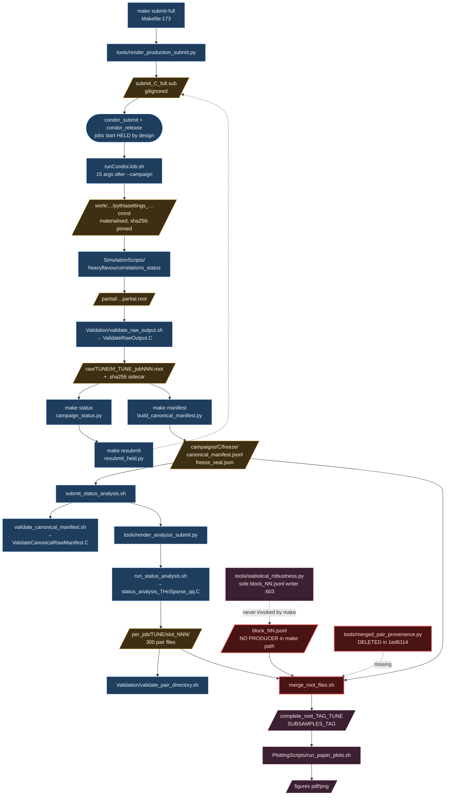
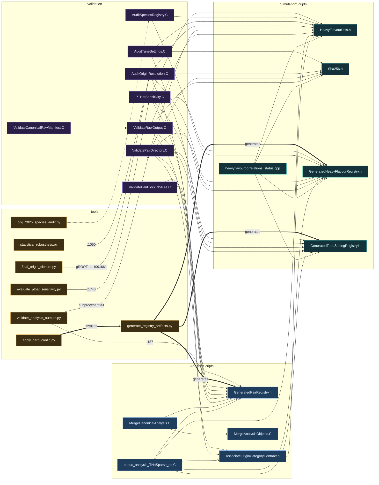
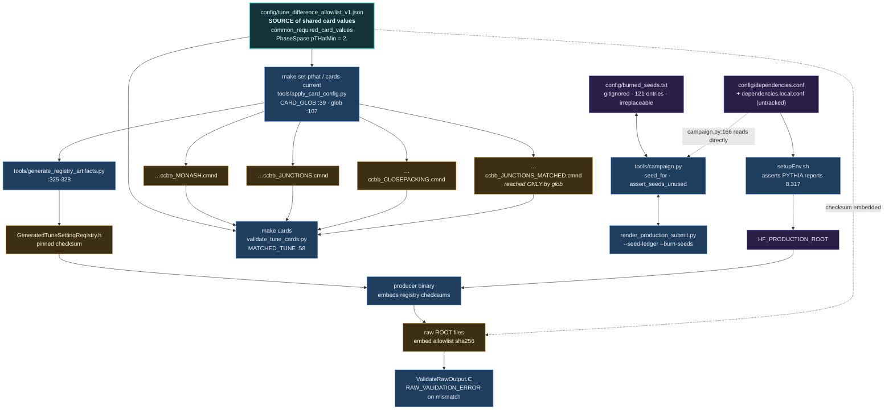
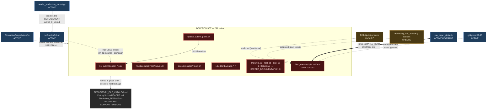

# Repository audit — `Hadronization`

## 1. Header

| | |
|---|---|
| **Tree mapped** | `c1bb0d979e33e5893c1ab73ba391e17441429bd4` (branch `physics-focus`) |
| **Read from** | `/private/tmp/hadronization-full-production` — clean worktree, `git status --porcelain` empty |
| **Nikhef checkout** | `/data/alice/ipardoza/Hadronization` — detached at `7cf9f86f37d327b580ad5e09a2f8513da9bacf94` ("Accept the flavour-closure objects in pair-directory validation", 2026-08-03 11:21:40 +0200). Tracked tree clean; 4 untracked `submit_*.sub`. |
| **Audit date** | 2026-08-03 |
| **Campaign status at audit time** | Cluster `5290145`: **drained** — `condor_q 5290145 -totals` reports 0 running, 0 idle, **1 held**. On-disk promoted raw under `HF_PRODUCTION_ROOT`: MONASH 10/10, JUNCTIONS 9/10, CLOSEPACKING 10/10 = **29/30**. |
| **Writes performed** | None. No `git add/commit/rm/checkout/stash/reset/clean`, no `condor_*` mutation, no file deleted or moved on either machine. `config/burned_seeds.txt` read only (121 lines, unchanged). |

A note on where I read: the handoff names `/private/tmp/hadronization-full-production` as the local worktree, and that is what I mapped. The primary working directory of this session, `/Users/wax/Documents/Research/Projects/Hadronization`, is on branch `main` at `11884cf` — a **different lineage** (`main` is the GitHub merge line; `physics-focus` is 39 commits ahead of `full-production`, which itself diverges from `main`). Nothing in this report is derived from the `main` tree.

---

## 2. Executive summary

### File counts by class

All 721 tracked files at `c1bb0d9`:

| Class | All files | Excluding ROOT data + generated figures |
|---|---:|---:|
| ACTIVE | 70 | 70 |
| ACTIVE-DORMANT | 37 | 37 |
| SUPPORT | 27 | 26 |
| LEGACY | 10 | 10 |
| STALE | 281 | 39 |
| **UNSURE** | **296** | **83** |
| **Total** | **721** | **265** |

The two columns differ because 264 generated plot artifacts (STALE) and 213 tracked `AnalyzedData/` ROOT files + archive (UNSURE) dominate the raw count. **Deletion set = LEGACY + STALE = 291 paths**, of which 264 are generated figures.

**Verified: zero edges from any ACTIVE or ACTIVE-DORMANT file into the deletion set.** (7 intra-set edges, which are permitted.) One SUPPORT doc names one deleted file.

### The five findings that matter most

**1. The merge stage has three independent blockers, none of which will surface until you run it.**
The merge is handoff next-step 4 and has never run. It fails at three separate points:

- `merge_root_files.sh:98,169,174` calls `python3 "${project_base}/tools/merged_pair_provenance.py"`. That file does not exist at `c1bb0d9`; it was deleted in `1ed6114` *"Remove campaign manifest, submission claims, and provenance stack"* — the gate-layer purge. First call site is inside `merge_one`, so this fires on the first tune.
- `merge_root_files.sh:191-192` reads `${freeze_dir}/block_NN.jsonl` for blocks 1–10. `make manifest` → `tools/build_canonical_manifest.py:256,269` writes **only** `canonical_manifest.jsonl` and `freeze_seal.json`. The sole writer of `block_NN.jsonl` anywhere in the repo is `tools/statistical_robustness.py:603`.
- `run_status_analysis.sh:336` writes `"raw_schema": "hf_primary_ground_raw_v5"` into `analysis_job_metadata.json`; `tools/validate_analysis_outputs.py:26` sets `RAW_SCHEMA = "hf_primary_ground_raw_v7"` and `:405` requires exact equality, raising at `:430-434`. `merge_root_files.sh:81` runs that validator as the merge's first gate. Every other file in the repo uses v7 — `run_status_analysis.sh` is the only v5 holdout.

The third one is the nastiest: it is self-consistent *within* the analysis stage (the writer and the re-validation branch at `:220` both say v5), so the analysis passes and the failure appears hours later at merge.

**2. `tools/statistical_robustness.py` is load-bearing, not deferred cleanup.**
The handoff lists it under "Untouched / not exercised" as "oversized, untouched, deliberately". It is also the only producer of the ten `block_NN.jsonl` files the merge consumes. Rewriting or deleting it without first relocating that writer breaks the merge. It is ACTIVE-DORMANT, never a deletion candidate.

**3. The constraint that motivated deleting the gate layer is still in the code.**
The handoff states the gate layer was removed partly because *"the old event-ID schema packed the tune ordinal into 2 bits (`HeavyFlavourUtils.h`, `tuneOrdinal > 3` threw), capping the study at four configurations."* At `c1bb0d9`, `SimulationScripts/HeavyFlavourUtils.h:404` still documents the layout `[campaign:16][tune:2][logical:14][attempt:12][local-success:20]` and `:409` still throws on `tuneOrdinal > 3`. **The repository wins: the four-configuration cap was not lifted.** ~40,000 lines were removed; the blocking constant was not among them.

**4. 264 tracked files are ROOT-generated plot output sitting in directories `.gitignore` already declares ignored.**
`.gitignore:53-55` ignores `PlottingScripts/Plots/`, `PlottingScripts/**/Plots/`, `Balancing_and_Sampling/**/Plots/`. The 264 files predate the rule, so it never took effect on them. They are 128 `.pdf`, 114 `.png`, and 22 `.C` files carrying the ROOT header `//=========Macro generated from canvas: … by ROOT version 6.30/01`. `PlottingScripts/validation/removed_tracked_plot_inventory.txt` records 78 such files already removed in `d8de9b6da` — this is the unfinished remainder, and the single largest safe win in the repo.

**5. The handoff's open question about empty provenance is answered — it was not a second failure.**
`Validation/ValidatePairDirectory.C:426-437`: when the object set differs, the code emits the `missing`/`unexpected object` failures and then `continue;` at `:437`. The provenance-capture block is at `:707-712`, **after** that `continue`. With all 300 files failing the object-set check, `commonAnalysisCommit`, `commonUpstreamCampaign` and `commonUpstreamRawSha` were never assigned and printed as empty strings. The empty provenance was a downstream artefact of the 900 unexpected-object errors. Falsifiable prediction: with `hFlavourClosure` and `centralEligible` now in `expectedObjects` (`:407-408`), the next real run's summary line carries non-empty values.

---

## 3. Nikhef vs `physics-focus` divergence

### The two states, as measured

```
# /data/alice/ipardoza/Hadronization  (Nikhef)
HEAD    7cf9f86f37d327b580ad5e09a2f8513da9bacf94
branch  HEAD                       # detached
status  ## HEAD (no branch)
        ?? submit_HF_PT2_smoke.sub
        ?? submit_HF_SMOKE2_retry3.sub
        ?? submit_HF_SMOKE2_smoke.sub
        ?? submit_HF_SMOKE_smoke.sub

# /private/tmp/hadronization-full-production  (local)
HEAD    c1bb0d979e33e5893c1ab73ba391e17441429bd4
branch  physics-focus
status  ## physics-focus            # nothing else — fully clean
```

### `git diff --stat 7cf9f86f3..c1bb0d9`

```
 Condor_README.md           |  10 ++-
 Makefile                   |  19 +++++-
 README.md                  |  19 ++++++
 tools/apply_card_config.py | 151 +++++++++++++++++++++++++++++++++++++++++++++
 4 files changed, 195 insertions(+), 4 deletions(-)
```

Every file that differs, with status:

| File | Status | Consequence |
|---|---|---|
| `Condor_README.md` | M | Doc only — adds the "take the cluster id from `condor_submit`, not the queue" guidance (`b14fd10`). |
| `Makefile` | M | Adds the `cards-current` and `set-pthat` targets that call `apply_card_config.py`. **Nikhef's Makefile has no `set-pthat`.** |
| `README.md` | M | Doc only — adds the "Changing a shared card setting" section. |
| `tools/apply_card_config.py` | **A** | Exists on `physics-focus` only. **Absent on Nikhef.** |

Two commits separate them: `b14fd10` (doc) and `c1bb0d9` (shared card settings).

### What this means for the audit

The divergence is small and confined to documentation plus one new tool. **No producer, validator, analysis, plotting, config or test file differs between the running cluster's tree and the tree being deleted from.** Nothing in the deletion set of section 6 is affected by which tree you look at.

**Files present on one tree and not the other:**

- `tools/apply_card_config.py` — on `physics-focus` only. Consequence: `make cards-current` and `make set-pthat` do not exist on Nikhef today; running them there fails until the branch is re-attached.
- `submit_HF_PT2_smoke.sub`, `submit_HF_SMOKE2_retry3.sub`, `submit_HF_SMOKE2_smoke.sub`, `submit_HF_SMOKE_smoke.sub` — on Nikhef only, untracked. See F2 below.
- `config/burned_seeds.txt` (121 lines), `config/dependencies.local.conf` (sets `HF_PRODUCTION_ROOT=/data/alice/ipardoza/hadronization_production`) — Nikhef only, gitignored, correctly so.
- On Nikhef only, gitignored build/output: ROOT ACLiC objects under `AnalysisScripts/`, `PlottingScripts/`; `AnalysisResults/`, `Production/`, `RootFiles/{HF,bbbar,ccbar,Previous}/`, `Logs/`, `campaigns/`, `.codex-tmp/`, `base_path.txt`, plus 8 stale `AnalyzedData/interrupted_*` and `pre_pr9_v4_backup_*` directories and 4 `submit_status_analysis_ALL_JobPR9_*.sub`.

### F2 — the `.gitignore` does not cover smoke or retry submits

`.gitignore:77-79`:

```
# Rendered Condor submit files (regenerate with make submit-prelim / submit-full)
submit_*_prelim.sub
submit_*_full.sub
```

`Makefile:153` renders `submit_$(CAMPAIGN)_smoke.sub`; `tools/resubmit_held.py` renders `_retryN.sub`. Neither pattern matches. Measured proof: on Nikhef those 4 files report as `??` (untracked) rather than `!!` (ignored).

This contradicts the handoff's *"`git stash -u` swallows gitignored submit files (`submit_*.sub`)"* — they are not gitignored, they are merely untracked, which is why `git stash -u` catches them and why `git add -A` would commit them. The fix is one line, but I am not making it.

---

## 4. Pipeline map

### Diagram 1 — Runtime data flow



Legend: **blue** = executable, **amber square** = artifact on disk, **pink dashed** = dormant (never run), **red** = broken today.

### Diagram 2 — Module dependency graph



Thick arrows are code generation, not inclusion: `generate_registry_artifacts.py:325-328` **writes** the three `Generated*.h` headers, so they are build outputs kept under version control.

### Diagram 3 — Configuration provenance



### Prose walkthrough

**Produce.** `make submit-full` (`Makefile:173`) calls `tools/render_production_submit.py`, which derives seeds from `tools/campaign.py`, refuses a seed already in `config/burned_seeds.txt`, refuses to render from a dirty checkout, hashes the producer binary, and emits a submit whose `executable = <base>/runCondorJob.sh` (`:271`) and `getenv = False` (`:273`). Jobs start `hold = True` (`:283`) by design; `periodic_hold` at `:290` implements the CPU-time hang guard (`RemoteUserCpu > 3600`), confirmed live on Nikhef's `submit_HF_PT2_smoke.sub:17-18`.

**Worker.** `runCondorJob.sh` refuses any invocation whose `$1` is not `--campaign` and any argument count other than 15 (`:27-37`); refuses inherited campaign control variables (`:101-115`); verifies commit, clean tree and producer SHA-256 (`:143-157`); then — and this ordering is load-bearing and commented as such at `:159-167` — sources `setupEnv.sh` **before** resolving `HF_PRODUCTION_ROOT`. It materialises the card via `tools/campaign.py materialize-card --expect-sha256` (`:211`), runs the producer, writes an immutable sidecar, validates via `Validation/validate_raw_output.sh`, and only then `mv -n`s the partial to `raw/`.

**Validate → promote.** `validate_raw_output.sh:31` loads `ValidateRawOutput.C` by string into ROOT and requires the exact marker `^RAW_VALIDATION_SUMMARY errors=0 ` (`:43`).

**Manifest.** `make manifest` → `build_canonical_manifest.py` globs `raw/*/hf_*_job*.root` (`:94`), pairs each with its attempt sidecar and validation receipt, and writes `canonical_manifest.jsonl` + `freeze_seal.json`. It computes `"blocks": BLOCKS` (=10) into the seal at `:279` but **does not write the block files themselves**.

**Analyse.** `submit_status_analysis.sh` runs `validate_canonical_manifest.sh`, then `validate_analysis_outputs.py --allow-missing`, then `render_analysis_submit.py`, which emits a submit with `executable = run_status_analysis.sh` (`:277`). Each analysis job runs `status_analysis_THnSparse_qq.C` on exactly one raw file and writes 300 pair files, gated by `validate_pair_directory.sh` — which hardcodes the campaign shape at `:35-38` (`trigger_histogram_digest_groups=12`, `…identity_comparisons=288`, `multiplicity_…comparisons=299`).

**Merge [DORMANT, BROKEN].** See finding 1.

**Plot [DORMANT].** `run_paper_plots.sh` validates the dataset selector fail-closed (`:131-139`, `:223-232`), then loads macros by string: `improvedPlotting_THnSparse.C` (`:307`, `:333`), `Plot_MultiplicityDistribution_PercentileBoundaries.C` (`:406`), `Plot_InclusiveKinematicSpectra_Raw.C` (`:429`, `:452`), the two `FinalAnalysis` macros (`:480`, `:494`), and `validate_thnsparse_inputs.sh` (`:618`). `plot_provenance_tool=""` at `:165` disables the gate-era provenance blocks, leaving dead-but-harmless code at `:563-580` and `:628-671`.

---

## 5. File-by-file inventory

The complete per-file record is `repo_inventory.csv` (721 rows). What follows is the grouped summary with the evidence that drove each classification.

### `/` (root, 22 files)

| Path | Class | Evidence |
|---|---|---|
| `Makefile` | ACTIVE | Entry point; handoff key-file table. |
| `runCondorJob.sh` | ACTIVE | `render_production_submit.py:271`; Nikhef `submit_HF_PT2_smoke.sub:2`. |
| `setupEnv.sh` | ACTIVE | Sourced by `runCondorJob.sh:169`, `build_producer.sh:11`, `run_status_analysis.sh:146`, `merge_root_files.sh:30`, `run_paper_plots.sh:270`, all 4 `Validation/*.sh`. |
| `run_status_analysis.sh` | ACTIVE | `render_analysis_submit.py:177,277`. Carries the v5/v7 defect. |
| `submit_status_analysis.sh` | ACTIVE | Handoff data-flow + next-step 3. |
| `.gitignore` | ACTIVE | See F2. |
| `merge_root_files.sh` | ACTIVE-DORMANT | Handoff next-step 4. Broken — three blockers. |
| `make_subsamples.sh` | ACTIVE-DORMANT | `:25` `exec`s `merge_root_files.sh`. |
| `README.md`, `REPRODUCIBILITY.md`, `Condor_README.md` | SUPPORT | Docs; see section 8. |
| `README.txt`, `REPOSITORY_FILE_CATALOG.md`, `plotting_documentation.md`, `PUBLICATION_READY_CODING_AGENT_INSTRUCTIONS.md` | UNSURE | See section 7. |
| `submitCondor_10M.sub`, `submitCondor_hf_10M.sub`, `submitCondor_hf_90M.sub`, `submitCondor_hf_90M_resubmit_4181781_held38.sub`, `submitCondor_hf_CLOSEPACKING_100M.sub`, `submitCondor_hf_missing_4862182_resubmit.sub` | **LEGACY** | Cannot run — see section 6 group 1. |
| `update_submit_paths.sh` | **LEGACY** | Serves only the six above. |

### `tools/` (17 files, 10,080 lines)

13 ACTIVE, 4 ACTIVE-DORMANT. Every one of the 13 is reached from a `Makefile` recipe or a live shell script — the edges are listed in the CSV `inbound_refs` column. The four dormant ones:

| Path | LOC | Class | Why not deletable |
|---|---:|---|---|
| `statistical_robustness.py` | 2761 | ACTIVE-DORMANT | **Sole writer of `block_NN.jsonl`** (`:603`), required by `merge_root_files.sh:191`. |
| `evaluate_pthat_sensitivity.py` | 2124 | ACTIVE-DORMANT | Handoff names it as deliberately parked; consumes `Validation/PTHatSensitivity.C:1740`. |
| `final_origin_closure.py` | 808 | ACTIVE-DORMANT | `tests/test_final_origin_closure.py` → `make check` fails. |
| `pdg_2025_species_audit.py` | 948 | ACTIVE-DORMANT | `tests/test_pdg_species_audit.py` → `make check` fails. |

> Handoff drift: it states *"`tools/` is now 15 files / 9,910 lines"*. Measured at `c1bb0d9`: **17 files / 10,080 lines** (16 at `7cf9f86f3`, before `apply_card_config.py`).

### `SimulationScripts/` (27 files)

ACTIVE: the producer, its 4 headers, `Makefile`, and the 3 campaign cards.
ACTIVE-DORMANT: `pythiasettings_Hard_Low_ccbb_JUNCTIONS_MATCHED.cmnd`.
UNSURE: the split bb/cc/qq producer stack and its cards (see section 7).
STALE: `Makefile.old`, `test_bb`, `test_cc`.

**The `JUNCTIONS_MATCHED` card is the audit's cleanest illustration of why a naive scan is unsafe.** It has **zero literal basename references anywhere in the repository**. It is nonetheless reached four ways:

- `tools/apply_card_config.py:39,107` — `CARD_GLOB = "SimulationScripts/pythiasettings_Hard_Low_ccbb_*.cmnd"` then `ROOT.glob(CARD_GLOB)`
- `tools/validate_tune_cards.py:58` — f-string `f"pythiasettings_Hard_Low_ccbb_{name}.cmnd"` with `name = MATCHED_TUNE`
- `tests/test_submit_rendering.py:33` — the same glob
- `runCondorJob.sh:90` — `card_name="pythiasettings_Hard_Low_ccbb_${tune}.cmnd"`, a shell-constructed path

Deleting it fails `make cards`, `make cards-current` and `make check`.

**`SimulationScripts/test_bb` / `test_cc`** are not test scripts. `file` reports *"ROOT file Version 63001 (Compression: 101)"* — 21 KB of one-off ROOT data committed without an extension. STALE.

### `AnalysisScripts/` (19 files)

ACTIVE: `status_analysis_THnSparse_qq.C`, `GeneratedPairRegistry.h`, `AssociateOriginCategoryContract.h`.
ACTIVE-DORMANT: `MergeCanonicalAnalysis.C`, `MergeAnalysisObjects.C` (`merge_root_files.sh:155`; `MergeCanonicalAnalysis.C:2` `#include`s `MergeAnalysisObjects.C`).
UNSURE: the entire pre-campaign analysis chain — `status_analysis_{bb,cc,qq}.C`, `{bb,cc,hf}_mult_pt_analysis_multi.C`, `run_{bb,cc,hf}_analysis.sh`, `qq_draw_2D_correlations.C`, and `CountEvents/`.

That chain is a **closed cluster with zero edges into live code**: `run_*_analysis.sh:81,84,96` → `*_mult_pt_analysis_multi.C`; `qq_draw_2D_correlations.C:4` → `status_analysis_qq.C`. It fails the evidence bar only on criterion 5/lineage: `README.txt:5` still calls `hf_mult_pt_analysis_multi.C` the *"preferred production"*, and the 213 tracked `AnalyzedData/` ROOT files were produced by it. See section 7 Q1.

### `Validation/` (22 files)

ACTIVE: `ValidateRawOutput.C`, `ValidatePairDirectory.C`, `ValidateCanonicalRawManifest.C`, `AuditSpeciesRegistry.C`, and 3 of the 4 `.sh` wrappers.
ACTIVE-DORMANT: `ValidatePairBlockClosure.C` + wrapper, `MeasureUnresolvedSystematic.C` (handoff next-step 6), `AuditTuneSettings.C` (handoff next-step 7), `AuditOriginResolution.C`, `PTHatSensitivity.C`, `CalibrateMultiplicityAgainstMinBias.C`, `ListUnresolvedOrigins.C`.
SUPPORT: the six `Test*.C` ROOT-level contract audits.
**LEGACY: `ValidateGateDPilotAnalysis.C`** — zero code inbound; the only mention anywhere is `docs/audits/FULL_PRODUCTION_CHANGE_JUSTIFICATION_AUDIT_20260730.md:236`, itself a gate-era document.

`AuditSpeciesRegistry.C` is ACTIVE rather than dormant because `tests/test_pdg_species_audit.py:230` names it — deleting it fails `make check`.

### `tests/` (24 files)

All ACTIVE. `Makefile:117` iterates `$(ROOT_DIR)/tests/test_*.py` — **glob discovery, so no test file is ever named by another file.** 21 `.py` files are executed by `make test`; the 3 `.cpp` files (`test_associate_origin_category.cpp`, `test_heavy_flavour_utils.cpp`, `test_pythia_runtime.cpp`) are compiled by other harnesses and are not run by that target.

### `config/` (10 files)

8 ACTIVE, 2 ACTIVE-DORMANT (`pthat_sensitivity_v1.json`, `statistical_robustness_v1.json` — both are test fixtures for `make check`).

### `PlottingScripts/` (273 files)

- **ACTIVE-DORMANT (18)**: `run_paper_plots.sh` and everything it reaches — `improvedPlotting_THnSparse.C`, `Plot_MultiplicityDistribution_PercentileBoundaries.C`, `Plot_InclusiveKinematicSpectra_Raw.C`, `Validate_THnSparse_Production.C`, `validate_thnsparse_inputs.sh`, the two `FinalAnalysis` macros, the 4 shared headers, the 2 THnSparse configs, plus `Plot_FlavourClosure.C`, `PlottingPathUtils.h`, `summarize_subsample_coverage.py`, `validate_subsample_log.py`.
- **SUPPORT (5)**: the READMEs, `PAPER_FIGURE_PROVENANCE.md`, `FINAL_PLOTTING_HANDOFF.md`, `removed_tracked_plot_inventory.txt`.
- **UNSURE (22)**: the pre-THnSparse path (`improvedPlotting.C`, `combinedCanvasPlots.C`, `ListHistos.C`, `PlottingWizard.C`, `Plot_KinematicSpectra_THnSparse.C`, 4 configs), the 10 `PtMultiplicity/` macros, the 6 `DpDmBpBm_ComparisonStudy/` macros.
- **STALE (228)**: generated plot artifacts under `**/Plots/`.

**`Plot_FlavourClosure.C` deserves a specific note.** It is the only file in the repository with **zero inbound references of any kind** — no code, no doc. A mechanical scan calls it an orphan. It is not: it was added `2026-07-31` (`f0a6efba8`, *"Draft the flavour-closure figure"*), and the observable it plots, `hFlavourClosure`, is **required** by `ValidatePairDirectory.C:407` as of `7cf9f86f3` — the exact commit the cluster is pinned at. It is new work not yet wired into `run_paper_plots.sh`. **ACTIVE-DORMANT.**

### `Balancing_and_Sampling/` (75), `Other/` (1), `RootFiles/` (3), `AnalyzedData/` (213), `ValidationReports/` (5), `docs/` (7), `Literature/` (2), `Paper/` (1)

- `Balancing_and_Sampling/`: 13 STALE editor backups; 27 UNSURE sources/tables; 27 STALE generated figures. Internally coupled — `Balancing_and_Sampling/B_Balancing_GeneralPlotting.C:1` `#include`s `PlottingScripts/B_Balancing_GeneralPlotting.C`, so the set moves together or not at all.
- `Other/B_Balancing_GeneralPlotting_BEFORE_DOCUMENTATION.C`: STALE. A named snapshot duplicate (3076 L) of `Balancing_and_Sampling/B_Balancing_GeneralPlotting.C` (3051 L). Sole occupant of `Other/`.
- `AnalyzedData/`: 212 `.root` + 1 `.zip`, ≈25 MB, tracked by an explicit `.gitignore:11-13` exception (`!AnalyzedData/**/*.root`). All UNSURE — see section 7 Q1.
- `docs/templates/*.json` (2): **LEGACY** — gate-layer authorisation schemas whose runners were deleted.

---

## 6. Deletion recommendation

### Diagram 4 — The deletion set and every adjacent live node



**No solid arrow crosses from a live node into the deletion set.** The only solid arrow inside the diagram is `update_submit_paths.sh → submitCondor_*.sub`, which is entirely internal to the set. Verified mechanically: 0 code edges from any ACTIVE/ACTIVE-DORMANT file into the 291 paths.

### Ordered deletion set

**Group 1 — LEGACY: pre-campaign Condor submit stack (7 files). Delete as one commit.**

| Path | Blast radius |
|---|---|
| `submitCondor_10M.sub` | Nothing |
| `submitCondor_hf_10M.sub` | Nothing |
| `submitCondor_hf_90M.sub` | Nothing |
| `submitCondor_hf_90M_resubmit_4181781_held38.sub` | Nothing |
| `submitCondor_hf_CLOSEPACKING_100M.sub` | Nothing |
| `submitCondor_hf_missing_4862182_resubmit.sub` | Nothing |
| `update_submit_paths.sh` | Nothing |

Evidence, all six criteria:
1. Zero inbound except `update_submit_paths.sh:31-35`, which is in the set.
2. Not in any Makefile.
3. Not ROOT-loaded.
4. `update_submit_paths.sh` is the *"ACTIVE-shaped file serving only LEGACY files"* case the brief asked me to flag — it is the dependency-order head of this set and must go in the same commit.
5. Not in the handoff's key-file table, data-flow block, or next-steps.
6. **They cannot execute.** `arguments = $(Cluster) $(JOBID) $(TUNE) $(NEVT_PER_JOB)` — 4 or 5 positional args. `runCondorJob.sh:27-31` requires `$1 == "--campaign"` and exactly 15 args, and exits 2 otherwise. Last substantive change `5b0a5e5a4` (2026-07-05) / `8c0bf9641` (2026-05-14); the `--campaign`-only form landed later, in `984370a` *"Decouple the surviving tools from the deleted gate layer"*.

Independent corroboration: all six hardcode `executable = /data/alice/ipardoza/Hadronization-main/runCondorJob.sh`, a checkout path that no longer exists, directly violating the stated rule at `Makefile:4-5` that *no tracked script contains a path that only works on one machine*. `update_submit_paths.sh:8` also depends on the gitignored `base_path.txt`, superseded by `config/dependencies.local.conf`.

**How you'd notice if I'm wrong:** you would not, from the build or the tests. You would notice if you ever tried to re-run a 2026-05/07 production by hand — and that attempt would fail *anyway*, at `runCondorJob.sh:29`, with a clear message.

**Group 2 — LEGACY: gate/provenance-era leftovers (3 files).**

| Path | Blast radius |
|---|---|
| `Validation/ValidateGateDPilotAnalysis.C` | Nothing |
| `docs/templates/FINAL_SCIENTIFIC_REVIEW.template.json` | Nothing |
| `docs/templates/PUBLICATION_DATASET_AUTHORIZATION.template.json` | Nothing |

Zero code inbound. Their consumers (`tools/run_publication_gate_{a,b,c,d}.py`) were deleted on `physics-focus`. Their sole mention is `docs/audits/FULL_PRODUCTION_CHANGE_JUSTIFICATION_AUDIT_20260730.md:236,282,283` — a gate-era audit that is itself UNSURE. Last substantive change `5140f813c` / `cad683555`, both 2026-07-30, i.e. the pre-deletion epoch.

**Group 3 — STALE: editor backup files (13 files).** All in `Balancing_and_Sampling/`. Tilde-suffixed backups committed wholesale in `e2d18da7c` (2026-02-24). Zero code inbound, no Makefile, no ROOT load. Blast radius: nothing. Note `CalculateErrors/yieldSampling.C~` is a backup of a file that no longer exists.

**Group 4 — STALE: misc (4 files).**

| Path | Evidence |
|---|---|
| `SimulationScripts/Makefile.old` | 3-line `CXXFLAGS` fragment superseded by `SimulationScripts/Makefile`. Named only in `Simulation_README.md:358` (doc edit). |
| `SimulationScripts/test_bb` | `file` → ROOT data, 21 KB, no extension. |
| `SimulationScripts/test_cc` | `file` → ROOT data, 21 KB, no extension. |
| `Other/B_Balancing_GeneralPlotting_BEFORE_DOCUMENTATION.C` | Snapshot duplicate; sole occupant of `Other/`. |

**Group 5 — STALE: generated plot artifacts (264 files).** `**/Plots/` — 128 `.pdf`, 114 `.png`, 22 `.C`. The `.C` files carry `//=========Macro generated from canvas: … by ROOT version 6.30/01`; several have function names containing hyphens (`SelectedParticleYields_Beauty_MONASH_12-01-2026_vs_27-03-2026()`), which is not valid C++ — they are archival canvas dumps, never compiled.

**I recommend doing groups 1–4 first and group 5 as a separate commit.** Groups 1–4 are 27 files and unambiguously dead. Group 5 is the large win but is the only group where deletion is lossy in a real sense: some of those figures were produced by macros I classified UNSURE (`PtMultiplicity/`, `DpDmBpBm_ComparisonStudy/`), so if you later delete those macros too, the figures become unreproducible. Git history retains both, but a separate commit makes the recovery obvious.

**Total: 291 paths.** The verification procedure is in `deletion_candidates.txt`.

---

## 7. UNSURE list — with the question that resolves each

296 files. They collapse into **nine questions**.

**Q1 — Are the 213 tracked `AnalyzedData/` ROOT files still needed, and should they be in git at all?**
*Files (223):* `AnalyzedData/**` (212 `.root` + 1 `.zip`), plus the chain that produced them: `AnalysisScripts/status_analysis_{bb,cc,qq}.C`, `{bb,cc,hf}_mult_pt_analysis_multi.C`, `run_{bb,cc,hf}_analysis.sh`, `qq_draw_2D_correlations.C`.
*Why unsure:* the chain has zero edges into live code and would be clean LEGACY — except that `run_paper_plots.sh:155-156` defaults `FINAL_INDEPENDENT_TAG=12-01-2026` and `FINAL_COMBINED_TAG=27-03-2026`, which are exactly two of the `AnalyzedData/` directory names. The dormant `final-multiplicity` / `final-yields` plotting targets read this data.
*What would break:* nothing today. If you delete the data and later run `make`-independent `run_paper_plots.sh final-multiplicity`, it fails at file-open — a loud runtime error, not a silent wrong number.

**Q2 — Do you still need the split bb/cc producers?**
*Files (13):* `SimulationScripts/{bbbar,ccbar}correlations_status[_JUNCTIONS].cpp`, `qqbarcorrelations_status.cpp`, 6 old `.cmnd` cards, `Batching_MONASH.sh`, `run_hf.sh`.
*Why unsure — and this is a hard blocker, not a soft one:* **criterion 2 fails.** `SimulationScripts/Makefile:55-57` lists all four in the `all:` target, `:59-69` gives them build rules, `:81-83` lists them in `clean:`. Deleting the sources breaks `make -C SimulationScripts all` and `make -C SimulationScripts clean` immediately.
*Note:* `make build` does **not** break — `tools/build_producer.sh:21-22` names the `heavyflavourcorrelations_status` target explicitly. So the ordinary pipeline survives, but the directory's own Makefile does not.
*If the answer is "delete":* this is an ordered set — **edit `SimulationScripts/Makefile` first** (remove from `all:`, delete the 4 rules, trim `clean:`), commit, then delete the sources. `docs/WORKSPACE.md:120` also names `Batching_MONASH.sh` and needs a doc edit.

**Q3 — Is the 2024-era `Balancing_and_Sampling/` study a provenance record for a published or thesis result?**
*Files (35):* 14 sources + 8 yield/error `.txt` tables + `ATTENTION.txt` + `PlottingScripts/B_Balancing_GeneralPlotting.C` + the 12 `Plots/*.C` canvas dumps already in group 5.
*Why unsure:* zero edges into live code; whole directory last touched `e2d18da7c` (2026-02-24) / `30341d5c1` (2026-03-28). But `Literature/pveen_14443260_msc_thesis-1_mwa2azwk.pdf` is a tracked MSc thesis, and this looks like its supporting analysis.
*Coupling:* `Balancing_and_Sampling/B_Balancing_GeneralPlotting.C:1` `#include`s `PlottingScripts/B_Balancing_GeneralPlotting.C`. They go together or not at all.
*What would break:* nothing mechanical.

**Q4 — Is the pre-THnSparse plotting path still wanted as a cross-check?**
*Files (9):* `improvedPlotting.C`, `configuration_{multiplicity,pT,pseudorapidity,rapidity}.json`, `combinedCanvasPlots.C`, `ListHistos.C`, `PlottingWizard.C`, `Plot_KinematicSpectra_THnSparse.C`.
*Why unsure:* none is reachable from `run_paper_plots.sh` (its only macro loads are at `:307,:333,:406,:429,:452,:469,:480,:484,:494,:618`). But `PlottingScripts/README.md:8,33,499-502` still documents them as available, and `FINAL_PLOTTING_HANDOFF.md:226` cites `Plot_KinematicSpectra_THnSparse.C`.
*What would break:* nothing. You would notice only when reaching for a cross-check that no longer exists.

**Q5 — Are the two-tune `PtMultiplicity/` subsample plots superseded by the three-tune THnSparse path?**
*Files (10 macros + `PlottingPathUtils.h`).*
*Why unsure:* not reachable from `run_paper_plots.sh`, but actively maintained through `39c9cf22a` (2026-07-24) — the same commit that fixed uncertainties in the live macros — and fully documented in `PlottingScripts/PtMultiplicity/README.md`. They compare MONASH vs JUNCTIONS only, i.e. two tunes, where the study now has three. **Recent maintenance is why these are UNSURE and not LEGACY.**

**Q6 — Does the `DpDmBpBm_ComparisonStudy` appear in the paper?**
*Files (6 macros).* Last change `e2d18da7c` (2026-02-24). Their outputs are 40 of the group-5 figures.

**Q7 — Is the `generated_heavy_flavor_summary` table going into the paper?**
*Files (4):* `AnalysisScripts/CountEvents/{count_events.sh,count_events_bb_cc.C,generated_heavy_flavor_summary.C}`, `Paper/Tables/generated_heavy_flavor_summary.tex`.
*Why unsure:* `Paper/Tables/generated_heavy_flavor_summary.tex:1` records that it was generated by `generated_heavy_flavor_summary.C`. Deleting the generator makes a paper table unreproducible — a *documentation* failure that surfaces at referee time, not build time.

**Q8 — Regenerate or delete `REPOSITORY_FILE_CATALOG.md`?**
*Files (4):* `REPOSITORY_FILE_CATALOG.md`, `PUBLICATION_READY_CODING_AGENT_INSTRUCTIONS.md`, `plotting_documentation.md`, `README.txt`.
*Why this matters beyond size:* `REPOSITORY_FILE_CATALOG.md` (305 KB, 699 lines) was generated `4a8d6ebb9` (2026-07-30) — **before** the ~40,000-line gate deletion. It is the sole doc referrer for roughly 30 files and is by far the largest source of stale filename references in the repo. Leaving it in place means every future audit re-derives the same false positives. Note `PUBLICATION_READY_CODING_AGENT_INSTRUCTIONS.md` is **untracked on `main` but tracked on `physics-focus`**.

**Q9 — Keep the gate-era audit records, or delete them with the gate layer?**
*Files (2):* `docs/audits/FULL_PRODUCTION_CHANGE_JUSTIFICATION_AUDIT_20260730.md` (zero inbound of any kind), `docs/audits/PRE_IMPLEMENTATION_SOURCE_OF_TRUTH_AUDIT.md`.
*Coupling:* the first is the sole referrer for all three group-2 LEGACY files. If you keep it, keep it knowing it documents deleted machinery.

**Also UNSURE (3 files), no group:** `RootFiles/{214_215_RootFilesDescriptions.txt, pTHatMinRootFilesDESCRIPTIONS.txt}` and `RootFiles/OlderProductions/DpDmBpBm_Comparison_RootFiles/DESCRIPTIONS.txt` describe ROOT files that `.gitignore:3` excludes from the repo. **Question:** does that data still exist under `RootFiles/` on Nikhef? (It does — `RootFiles/{HF,bbbar,ccbar,Previous}/` are present and ignored there — so these descriptions are live documentation of live data, just not of anything in git.)

---

## 8. Documentation audit

### 8.1 Claim-level table

Checked against code at `c1bb0d9`. Verdicts: **accurate** / **outdated** / **contradicted** / **unverifiable**.

| file | line | claim (quoted short) | verdict | evidence | suggested correction |
|---|---|---|---|---|---|
| `docs/DESIGN_AND_RATIONALE.md` | 324 | `./run_publication_gate_a.sh <outdir>` | **contradicted** | File absent at `c1bb0d9`; gate runners deleted in `1ed6114` | Replace with `make check` |
| `docs/DESIGN_AND_RATIONALE.md` | 338-341 | "gates are ordered … A static/unit, B … E full campaign" | **contradicted** | No gate runner exists | Delete; describe `make check` + campaign flow |
| `docs/DESIGN_AND_RATIONALE.md` | 305-307 | "`tests/test_canonical_merge_contract.py`, `tests/test_superseding_canonical_expansion.py`" | **contradicted** | Neither file exists | Cite `tests/test_submit_rendering.py` or remove |
| `docs/DESIGN_AND_RATIONALE.md` | 161-162 | "run permanently as part of Gate A and fail-closed" | **contradicted** | Gate A gone; `CalibrateMultiplicityAgainstMinBias.C` has zero code inbound | State it is run manually |
| `docs/DESIGN_AND_RATIONALE.md` | 176-177 | "hard-heavy sample sits ~36% *below* minimum bias" | **outdated** | pTHat now 2.0 (`…_MONASH.cmnd:47`); handoff measures within 4.2% | Delete the sentence — the handoff says delete, not correct |
| `docs/DESIGN_AND_RATIONALE.md` | 370-377 | "Measured ~36% lower … `PhaseSpace:pTHatMin = 1`" | **contradicted** | `PhaseSpace:pTHatMin = 2.` in all 4 ccbb cards and `tune_difference_allowlist_v1.json:53` | Rewrite limitation 1 for 2.0 |
| `docs/DESIGN_AND_RATIONALE.md` | 373 | "`MultipartonInteractions:pT0Ref = 2.15`" | **outdated** | Per-tune: JUNCTIONS `2.15` (`:30`), CLOSEPACKING `2.194` (`:31`), MONASH inherits `2.28` (card comment `:30`) | State it is tune-dependent; give all three |
| `docs/DESIGN_AND_RATIONALE.md` | 168 | table row "pTHatMin = 1 GeV \| 4.558" | **outdated** | Card comments record `4.973` at pTHat 1.0 on 8.317 vs `6.968` MB | Re-measure at 2.0 on 8.317 |
| `docs/DESIGN_AND_RATIONALE.md` | 270 | "PYTHIA 8.315 contains an unbounded accept-reject loop" | **outdated** | `config/dependencies.conf:36` pins `8.317` | Note the version the hang was observed on vs the pinned one |
| `docs/DESIGN_AND_RATIONALE.md` | 299 | "`[campaign:16][tune:2][logical:14][attempt:12][local-success:20]`" | **accurate** | `HeavyFlavourUtils.h:404,409,416` — still 2 bits, still throws on `>3` | None — but see finding 3 |
| `docs/DESIGN_AND_RATIONALE.md` | 349 | raw schema `hf_primary_ground_raw_v7` | **accurate** | 16 files agree; `HeavyFlavourUtils.h` | None |
| `docs/DESIGN_AND_RATIONALE.md` | 84 | "`Beams:eCM = 13600` in all three tune cards" | **accurate** | `tune_difference_allowlist_v1.json` `common_required_card_values` | None |
| `docs/DESIGN_AND_RATIONALE.md` | 67-71 | "`B+` … `q_b = -1`. `Lambda_b0` … `q_b = +1`" | **accurate** | Matches handoff constraint block | None |
| `docs/DESIGN_AND_RATIONALE.md` | 263-267 | "1000 canonical jobs (candidate slots 1000/2000/2000)" | **unverifiable** | `Makefile:25` `JOBS ?= 1000` is a default, not a contract; no code encodes 2000 | State it as an operational default |
| `README.md` | 30-31 | "A 30-job smoke test … completed 29/29 with zero hangs" | **outdated** | Arithmetic: 30 jobs, 29 completions. On disk now HF_PT2 is 29/30 with 1 held | Say 29/30, or name the campaign |
| `README.md` | 35-38 | "analysis, merge and plotting … not been exercised end to end" | **accurate** | Confirmed; merge has 3 blockers | Add that the merge is currently broken |
| `README.md` | 66 | "`make set-pthat PTHAT=2.0`" | **accurate** | `Makefile:138-142` | None |
| `README.md` | 88 | "`merge_root_files.sh` merge analysis outputs" | **contradicted** | Cannot run: `merge_root_files.sh:98,169,174` calls deleted `tools/merged_pair_provenance.py` | Mark the stage broken |
| `README.md` | 124-128 | numbered list "1." then "3." | **accurate** (typo) | Item 2 is missing | Renumber |
| `README.md` | 137, 206 | "21 contract tests" | **accurate** | `Makefile:117` globs `tests/test_*.py` = 21 | None (`tests/` holds 24; 3 are `.cpp`) |
| `README.md` | 158 | raw schema `hf_primary_ground_raw_v7` | **accurate** | — | None |
| `README.md` | 54-56 | "Eight downstream components still assume exactly three tunes" | **outdated (undercount)** | At least **14** non-comment hardcoded triples: `merge_root_files.sh:186,202`; `tools/validate_tune_cards.py:10`; `tools/campaign.py:34`; `tools/statistical_robustness.py:39`; `tools/validate_analysis_outputs.py:20`; `tools/generate_registry_artifacts.py:359`; `PlottingScripts/validate_subsample_log.py:19,104`; `PlottingScripts/summarize_subsample_coverage.py:18`; `PlottingScripts/TunePlotStyle.h:13`; `PlottingScripts/Validate_THnSparse_Production.C:44`; `Plot_InclusiveKinematicSpectra_Raw.C:789,1953`; plus `tests/test_plot_dataset_integration.py:15`, `tests/test_submit_rendering.py:103` | Say "at least fourteen", or better, replace the count with a pointer to `tools/campaign.py:34` as the one place a tune list should live |
| `README.md` | 202 | "`tools/`: campaign.py … doctor.sh" | **outdated** | Lists 6 of 17 tools; omits `apply_card_config.py`, added in this very commit | Add it |
| `REPRODUCIBILITY.md` | 22 | "`PhaseSpace:pTHatMin = 2.0 GeV`" | **accurate** | `…ccbb_MONASH.cmnd:47`; `tune_difference_allowlist_v1.json:53` | None |
| `REPRODUCIBILITY.md` | 18 | "PYTHIA: 8.317, stock upstream" | **accurate** | `config/dependencies.conf:35-36` | None |
| `REPRODUCIBILITY.md` | 27 | "raw schema: `hf_primary_ground_raw_v7`" | **accurate** | 16 files agree | None |
| `REPRODUCIBILITY.md` | 53 | "`B+` (521) has `q_b = -1` … `Lambda_b0` (5122) … `+1`" | **accurate** | Matches `DESIGN…:67-71` and the handoff | None |
| `REPRODUCIBILITY.md` | 66 | "it previously hardcoded `8.315`" | **accurate** | `setupEnv.sh` now asserts the pinned version (`c419cc9f5`) | None |
| `Condor_README.md` | — | `MAX_CPU` / 3600 guard | **accurate** | `Makefile:42`; Nikhef `submit_HF_PT2_smoke.sub:17` | None |
| `README.txt` | 5 | "preferred production is … `hf_mult_pt_analysis_multi.C`" | **contradicted** | The live analysis is `status_analysis_THnSparse_qq.C` (`run_status_analysis.sh:21`) | Fix or delete the file |
| `AnalysisScripts/Analysis_README.md` | — | references `hf_primary_ground_raw_v5` | **outdated** | Schema is v7 everywhere except `run_status_analysis.sh:336` | Update to v7 |
| `SimulationScripts/Simulation_README.md` | — | references `hf_primary_ground_raw_v5` | **outdated** | as above | Update to v7 |
| `plotting_documentation.md` | — | references `hf_primary_ground_raw_v5` | **outdated** | as above | Update to v7 |
| `SimulationScripts/Simulation_README.md` | 358 | names `Makefile.old` | **outdated** | Proposed for deletion (group 4) | Remove the line |
| `docs/WORKSPACE.md` | 120 | names `Batching_MONASH.sh` | **unverifiable** | File exists; classified UNSURE (Q2) | Resolve with Q2 |
| `make_subsamples.sh` | 12 | "first-stage freeze has 100 jobs per tune" | **outdated** | `Makefile:25` `JOBS ?= 1000`; `DESIGN…:263` says 1000 | Align with 1000 |
| `REPOSITORY_FILE_CATALOG.md` | throughout | catalogues ~40k lines of deleted gate machinery | **contradicted** | Generated `4a8d6ebb9` 2026-07-30, pre-deletion | Regenerate or delete (Q8) |
| `docs/audits/FULL_PRODUCTION_…_20260730.md` | 236,282,283 | cites `ValidateGateDPilotAnalysis.C`, the 2 gate templates | **accurate as history** | Those files exist but are LEGACY | Mark the document historical |

### 8.2 The reverse direction — design decisions implemented in code and in **no** `.md`

`docs/DESIGN_AND_RATIONALE.md:13-16` states the rule: *"no design choice may exist only in code."* These violate it. Each was checked with `git grep -l -F <term> -- '*.md'` returning empty.

1. **The pair-file required-object contract.** `ValidatePairDirectory.C:406-408` makes `hFlavourClosure` and `centralEligible` **required**, and `:409` makes `hFlavourClosureSummary` **permitted but not required**. The reasoning — that a rare species with no triggers writes no summary and would otherwise fail — is a genuine physics-driven design choice, and it is recorded only in a C++ comment at `:400-406`. **Zero `.md` mentions of either object name.** This is the change at `7cf9f86f3`, the commit the cluster is pinned at, and the fix for the 900-error blocker. It is the most consequential undocumented decision in the repo.

2. **The 300-file / 12-group campaign shape.** `validate_pair_directory.sh:35-38` hardcodes `trigger_histogram_digest_groups=12`, `trigger_histogram_identity_comparisons=288`, `multiplicity_histogram_digest_groups=1`, `…identity_comparisons=299`. `validate_pair_block_closure.sh:41` hardcodes `central_pair_files=300 block_pair_files=3000 object_content_sumw2_closure_checks=1500 …`. **Zero `.md` mentions.** These are exactly the *"hardcoded-campaign-shape assumptions"* the handoff warns about for the merge — and they are already present in the analysis path, not just the merge path.

3. **The decision to disable plot provenance rather than delete the blocks.** `run_paper_plots.sh:162-165` sets `plot_provenance_tool=""` with the comment *"Final-plot provenance tracking was part of the gate layer and has been removed"*, leaving ~60 lines of dead conditional at `:563-580` and `:628-671`. **Zero `.md` mentions.** The handoff mentions it in next-step 5; no repository document does.

4. **The `raw_schema: v5` string in `run_status_analysis.sh`.** Not a decision so much as an undocumented contract that contradicts every other file. It appears in three `.md` files as v5 — so the docs are *consistent with the defect*, which is why it survived.

5. **The `.gitignore` scope decision for submit files.** `.gitignore:77-79` covers `_prelim`/`_full` but not `_smoke`/`_retryN`. Whether that is deliberate (smoke submits are evidence worth keeping) or an oversight is not stated anywhere.

### 8.3 Per-file verdicts

| File | Verdict |
|---|---|
| `docs/DESIGN_AND_RATIONALE.md` | **needs amendment** — the physics sections (2, 3.1–3.4, 3.6–3.10, 5) are accurate and valuable; sections 3.5, 3.11, 4 and 6 carry pTHat-1.0 and gate-era claims that are now contradicted. Priority fix: section 4 tells a newcomer to run a script that does not exist. |
| `README.md` | **needs amendment** — structurally right, drifted in details (merge status, tools list, smoke-test arithmetic, the "eight components" count). |
| `REPRODUCIBILITY.md` | **accurate** — the best-maintained document in the repo. Every claim I checked (pTHat 2.0, PYTHIA 8.317, raw_v7, sign convention, the 8.315 version-pin history) holds. It is dated `40d256de6` "Set pTHatMin to 2.0" and shows it. Use it as the model for amending the others. |
| `Condor_README.md` | **accurate** — the hang-guard and cluster-id guidance match the code. |
| `docs/WORKSPACE.md` | **needs amendment** — one stale reference (`Batching_MONASH.sh`), otherwise sound. |
| `docs/NIKHEF_BRINGUP.md` | **accurate** |
| `AnalysisScripts/Analysis_README.md` | **needs amendment** — raw_v5 references. |
| `SimulationScripts/Simulation_README.md` | **needs amendment** — raw_v5 references, `Makefile.old`, `qqbarcorrelations_status.cpp`. |
| `PlottingScripts/README.md` | **needs amendment** — documents the pre-THnSparse path as current (Q4). |
| `PlottingScripts/{FinalAnalysis,PtMultiplicity}/README.md` | **needs amendment** — pending Q5. |
| `PlottingScripts/PAPER_FIGURE_PROVENANCE.md` | **needs amendment** — written under the gate-era provenance tool now disabled. |
| `PlottingScripts/validation/FINAL_PLOTTING_HANDOFF.md` | **accurate as history** |
| `plotting_documentation.md` | **rewrite or delete** — overlaps `PlottingScripts/README.md`, carries raw_v5. |
| `README.txt` | **rewrite or delete** — its one substantive sentence is now wrong. |
| `REPOSITORY_FILE_CATALOG.md` | **delete or regenerate** — catalogues deleted machinery; largest source of false positives. |
| `PUBLICATION_READY_CODING_AGENT_INSTRUCTIONS.md` | **needs amendment** — pre-gate-deletion; also inconsistently tracked across branches. |
| `docs/audits/*` (2) | **accurate as history** — keep only if explicitly marked historical. |
| `ValidationReports/*` (5) | **accurate** — dated measurement records; `dependencies.conf:25` cites one, so at least one is load-bearing documentation. |

---

## 9. Files I could not fully read, and why

**Read in full:** `Makefile`, `runCondorJob.sh`, `merge_root_files.sh`, `run_status_analysis.sh`, `submit_status_analysis.sh`, `make_subsamples.sh`, `update_submit_paths.sh`, `PlottingScripts/run_paper_plots.sh`, `tools/doctor.sh`, `tools/build_producer.sh`, all four `Validation/*.sh`, `SimulationScripts/Makefile`, `config/dependencies.conf`, `README.md`, `docs/DESIGN_AND_RATIONALE.md`, `README.txt`, `SimulationScripts/Makefile.old`, `.gitignore`, and Nikhef's `config/dependencies.local.conf`.

**Sampled — head, tail, all definition/include/entry-point lines, plus every line matching the reference and schema patterns of Phase 2:**

- The 8 large ROOT macros over 900 lines: `AnalysisScripts/status_analysis_THnSparse_qq.C` (1384), `Validation/ValidateRawOutput.C` (2347), `Validation/ValidatePairDirectory.C` (917 — regions `340-360`, `400-470`, `500-530`, `690-740`, `795-815` read in full), `PlottingScripts/improvedPlotting_THnSparse.C` (4914), `Plot_InclusiveKinematicSpectra_Raw.C` (1974), `Plot_MultiplicityDistribution_PercentileBoundaries.C` (1120), `Validate_THnSparse_Production.C` (1147), `Validation/AuditOriginResolution.C` (1148).
- The 2 oversized tools: `tools/statistical_robustness.py` (2761), `tools/evaluate_pthat_sensitivity.py` (2124). For these I read the path-literal, glob, schema-string and `block_`/`freeze_` regions specifically; the `block_NN.jsonl` finding comes from `:603` read in context.
- The remaining `tools/*.py` (13 files): read all path literals, `argparse` surfaces, schema constants, and the specific regions cited in this report (`validate_analysis_outputs.py:375-434,540-575`; `build_canonical_manifest.py:250-295`).
- `Balancing_and_Sampling/**` and `PlottingScripts/{PtMultiplicity,DpDmBpBm_ComparisonStudy}/**` sources: read `#include` lines, the `.L` usage comments in their headers, and first ~50 lines. Several exceed 3000 lines. **This is why the whole `Balancing_and_Sampling` set is UNSURE rather than LEGACY** — I have not read enough of it to assert it contains nothing load-bearing.
- `REPOSITORY_FILE_CATALOG.md` (305 KB) and `PUBLICATION_READY_CODING_AGENT_INSTRUCTIONS.md` (128 KB): grepped for filename references only, not read as prose. Both are UNSURE partly for this reason.
- `REPRODUCIBILITY.md`, `Condor_README.md`, `docs/WORKSPACE.md`, `docs/NIKHEF_BRINGUP.md`, and the 5 directory READMEs: grepped for the specific claims in the table above; not exhaustively claim-extracted. **The claim table in section 8.1 is therefore complete for `docs/DESIGN_AND_RATIONALE.md` and `README.md` and partial for the rest.**

**Not opened at all:** the 212 `AnalyzedData/*.root` files, 1 `.zip`, 128 `.pdf`, 114 `.png`, `SimulationScripts/test_{bb,cc}` (identified via `file`), and `Literature/pveen_…msc_thesis-1.pdf`. These are binary data; `file` and `git log` were the evidence.

**Excluded from enumeration and why:** `.git/` (VCS internals); ROOT ACLiC build objects (`*_C.so`, `*_C.d`, `*_ACLiC_dict_rdict.pcm` — regenerated on every macro load, already `.gitignore:47-50`); `__pycache__/`; and on Nikhef the gitignored data trees (`Production/`, `AnalysisResults/`, `RootFiles/{HF,bbbar,ccbar,Previous}/`, `Logs/`, `logs/`, `campaigns/`, `AnalyzedData/{complete_root_*,SUBSAMPLES_*,interrupted_*,pre_pr9_v4_backup_*,_merge_benchmark}/`). I inspected the Nikhef-only untracked files that reference tracked code (the 4 `submit_*.sub`) and the two gitignored config files, as the brief allowed.

---

## 10. Open questions

**For you, blocking the deletion:** the nine questions in section 7. Q2 is the only one with a mechanical consequence (`SimulationScripts/Makefile` must be edited first); the rest are judgement calls about what is worth keeping.

**About the pipeline, which the audit surfaced and I could not resolve from the repository:**

1. **Which of the three merge blockers do you want to fix, and how?** `tools/merged_pair_provenance.py` was deleted deliberately as part of the provenance stack, but `merge_root_files.sh` was not updated to match. Two readings: either the merge should lose its provenance calls the way `run_paper_plots.sh:165` and `run_status_analysis.sh:23` lost theirs (both have explicit "was part of the gate layer" comments; `merge_root_files.sh` has no such comment at any of its three call sites), or the tool should come back. **The absence of a comment there, where the two sibling scripts both have one, suggests the merge was simply missed in `984370a` "Decouple the surviving tools from the deleted gate layer".**

2. **Where should `block_NN.jsonl` be written?** Today only `statistical_robustness.py:603` writes it, and nothing in the `make` path invokes that file. `build_canonical_manifest.py` already computes the block assignment (`:166-167` writes `"block"` and `"block_position"` per row) and records `"blocks": 10` in the seal (`:279`) — it has everything needed to emit the ten files and does not. That looks like a one-function gap rather than a design question.

3. **Is the 2-bit tune ordinal meant to still be there?** Finding 3. If the mechanism-isolation design needs more than four configurations, this is the thing to widen, and none of the ~40,000 deleted lines touched it.

4. **`hf_raw_validation_receipt` v1 vs v2.** `runCondorJob.sh:304` writes receipts as `v2`. `Validation/AuditOriginResolution.C:427` and `Validation/ListUnresolvedOrigins.C:57` read the receipt's own `schema` field and **require v1** — they would reject every receipt the current worker writes. This is currently harmless because neither macro is in the live path, but both are ACTIVE-DORMANT and `AuditOriginResolution.C` is reachable from `tools/final_origin_closure.py` and `tests/test_final_origin_closure.py`.

5. **The held job in cluster 5290145.** JUNCTIONS is 9/10 promoted and one job is held. Per the handoff, `campaign_status.py`'s `no_verdict` includes operator removals, so whether this is a hang or something else needs `campaign_status.py HF_PT2 --expected-jobs 10` to say. The queue is otherwise empty, which means the handoff's precondition for returning Nikhef to the branch is now met.

6. **`README.md:54` claims "eight downstream components still assume exactly three tunes." The real number is at least fourteen** — enumerated in the claim table. This matters because that count is the stated blocker on running `JUNCTIONS_MATCHED`, which is the cleanest answer to the tune-bundle confound in the handoff's physics-open list. The work is roughly twice what the README implies. Worth noting that `tools/campaign.py:34-54` already provides `PUBLISHED_TUNES` / `OPTIONAL_TUNES` / `ALL_TUNES`; nine of the fourteen sites could import from it instead of restating the triple, which is the same "replicated constant that drifted" failure the gate deletion was meant to end.

---

### Artifacts

| File | Contents |
|---|---|
| `REPO_AUDIT_c1bb0d9.md` | This report |
| `repo_inventory.csv` | 721 rows, one per tracked file |
| `deletion_candidates.txt` | 291 paths in 5 ordered groups + verification procedure |
| `_findings_running.md` | Incremental findings log written during the audit |
| `_refs_split.json`, `_base_inventory.json`, `_classified.json`, `_classify.py` | Raw evidence and the classification script, so every CSV cell is reproducible |
